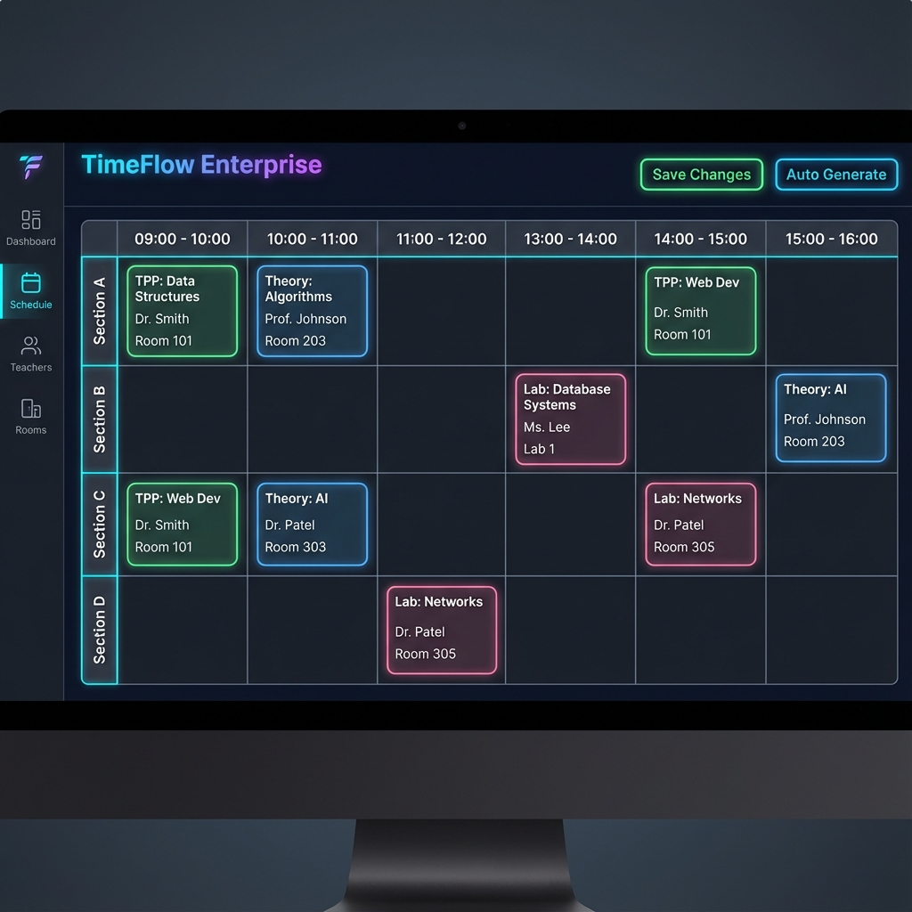
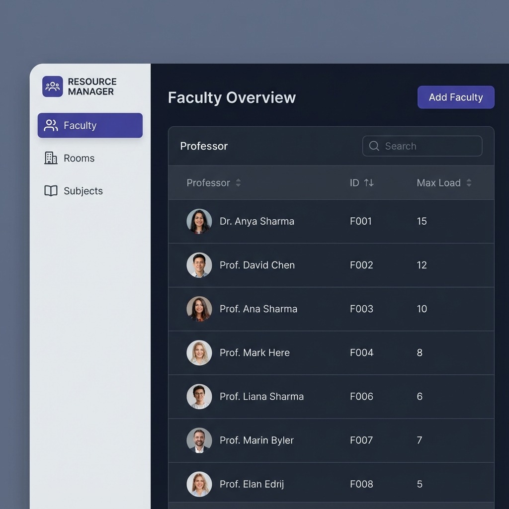

# Intelligent Timetable Solution (Enterprise Edition)

  

**A next-generation automated scheduling platform designed for complex academic and organizational environments.**

This solution leverages advanced constraint programming and a modern, reactive interface to solve the classic "Timetabling Problem." It moves beyond simple spreadsheets to offer dynamic conflict detection, resource management, and automated generation.



## 🚀 Key Features

### 🧠 Intelligent Scheduling Engine
*   **Automated Generation**: Powered by Google OR-Tools to solve complex constraints (Faculty availability, Room capacity, Lab requirments) in seconds.
*   **Asynchronous Processing**: Heavy computations are offloaded to background workers (Celery/Redis), ensuring a fluid UI.
*   **Conflict Resolution**: Real-time detection of double-booked faculty or rooms across multiple sections.

### 🎨 Modern Experience
*   **Dynamic Interface**: Drag-and-drop aesthetics, context-aware styling (TPP vs Normal tracks), and responsive design.
*   **Resource Management**: Dedicated Admin Dashboard to manage Faculty, Rooms, and Subjects.
*   **Visual Feedback**: Instant visual cues for conflicts, workload limits, and successful saves.

### 🛠️ Enterprise Ready
*   **Dockerized**: Fully containerized Architecture (Frontend, Backend, Worker, Database, Redis).
*   **Scalable**: Built on FastAPI (Async Python) and React (Vite), ready for high-concurrency environments.
*   **Persistence**: Robust PostgreSQL database for secure data storage.

---

## 📸 Visual Tour

### Intelligent Grid Interface
Manage your weekly schedule with precision. Supports dynamic time slots and specialized section tracks.


### Resource Command Center
Centralized management for Professors, Classrooms, and Curriculum definitions.


### Real-time Analytics
Insight into resource utilization and scheduling efficiency.


---

## ⚡ Quick Start

### Option 1: One-Click Production Run (Recommended)
If you have Docker Desktop installed, simply run the provided script:

**Windows:**
```powershell
./run-prod.bat
```

**Mac/Linux:**
```bash
docker-compose -f docker-compose.prod.yml up -d
```

Access the application at: `http://localhost`

### Option 2: Build from Source
```bash
git clone https://github.com/STiFLeR7/TTGv1-Docker.git
cd TTGv1-Docker
docker-compose up --build
```

---

## 🏗️ Technology Stack

*   **Frontend**: React, TypeScript, TailwindCSS, Vite
*   **Backend**: Python, FastAPI, SQLAlchemy (Async)
*   **Solver**: Google OR-Tools (CP-SAT)
*   **Task Queue**: Celery, Redis
*   **Database**: PostgreSQL
*   **Containerization**: Docker, Nginx

---

## 🤝 Contribution
Contributions are welcome! Please fork the repository and submit a pull request.

1.  Fork the Project
2.  Create your Feature Branch (`git checkout -b feature/AmazingFeature`)
3.  Commit your Changes (`git commit -m 'Add some AmazingFeature'`)
4.  Push to the Branch (`git push origin feature/AmazingFeature`)
5.  Open a Pull Request

---

*Designed for effiency. Built for scale.*
